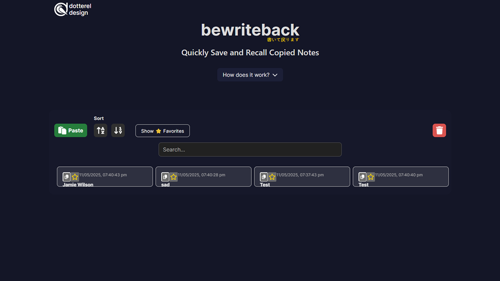

# bewriteback ✍️🔁

A lightning-fast, privacy-friendly clipboard manager for your browser — organize, save, and recall snippets, notes, and code, all in one beautiful PWA.



---

## Table of Contents

- [What is bewriteback?](#what-is-bewriteback)
- [Why does it exist?](#why-does-it-exist)
- [Who is it for?](#who-is-it-for)
- [Features](#features)
- [How does it work?](#how-does-it-work)
- [Installation & Usage](#installation--usage)
- [PWA (Install to Desktop/Mobile)](#pwa-install-to-desktopmobile)
- [Folder & Card System](#folder--card-system)
- [Keyboard Shortcuts](#keyboard-shortcuts)
- [Tech Stack](#tech-stack)
- [Development & Contributing](#development--contributing)
- [License](#license)
- [Credits](#credits)

---

## What is bewriteback?

**bewriteback** is a modern web app for anyone who constantly copies, pastes, and juggles text, code, links, or notes throughout their day.

Think of it as a supercharged, user-friendly **clipboard manager** that lives entirely in your browser — no accounts, no servers, no privacy worries.

- **Copy** something.
- **Paste** it into bewriteback.
- **Name** it.
- **Recall** or **reuse** it at any time — with one click.

All your snippets are saved locally and instantly accessible, organized as **cards** and **folders**.

---

## Why does it exist?

**The Problem:**
- Modern workflows rely heavily on copy-paste, but browsers don’t let you _save_ anything for later.
- System clipboards are ephemeral and often hard to browse, clear, or organize.
- Existing clipboard managers are mostly native apps, require permissions, or are overkill for most users.
- Sensitive data shouldn’t leave your device or require cloud sync.

**bewriteback solves these by:**
- Running **100% in-browser** (PWA-ready: install as an app if you want).
- Never uploading your data — your notes/snippets/cards/folders live _only_ in your browser’s local storage.
- Offering a clear, simple, and beautiful UI for pasting, labeling, sorting, organizing, and recalling your important copied text.

---

## Who is it for?

- **Developers**: Store code snippets, API keys (careful!), command-line tricks, or regexes.
- **Writers & Editors**: Keep blocks of reusable text, canned replies, or research snippets.
- **Students & Researchers**: Collect citations, quotes, and ideas as you browse.
- **Support & Helpdesk**: Prepare responses, macros, or common solutions for instant use.
- **Anyone** who copies and pastes frequently — and wishes the clipboard had a memory!

---

## Features

- **Save Anything:** Text, code, links, and notes, instantly.
- **Name and Organize:** Every paste becomes a card with your chosen title.
- **Folders:** Group related cards into folders for powerful organization.
- **Favorites:** Star your most-used pastes for quick access.
- **Search:** Filter your cards and folders instantly.
- **Sort:** By name, time, or drag to reorder (custom mode).
- **Keyboard-First:** Fully accessible and fast — paste and copy with keyboard shortcuts.
- **Drag & Drop:** Rearrange cards, and drag cards into folders.
- **PWA:** Install as a desktop/mobile app for native-like experience.
- **Privacy First:** Everything stays local. No accounts, no tracking, no data ever leaves your device.
- **One-click Copy:** Click any card to instantly copy its contents back to your clipboard.
- **Lightweight:** Built with modern React and Vite, loads instantly and works offline.

---

## How does it work?

1. **Paste**: Hit <kbd>Ctrl+V</kbd> (or <kbd>Cmd+V</kbd>) or click the “Paste” button to add your current clipboard content.
2. **Name**: A modal pops up. Give your snippet a clear name.
3. **Save**: Your snippet is saved as a card on the board.
4. **Recall**: Click the card to copy it back to your clipboard at any time.
5. **Organize**: Use folders, favorites, sorting, and drag-and-drop for advanced organization.
6. **Install**: Use as a PWA — works offline, saves state locally, and can be installed on any device.

---

## Folder & Card System

- **Cards** are individual pasted items (with a name and timestamp).
- **Folders** group cards — drag a card onto a folder to move it inside, or drag it back out.
- **Drag & drop** is enabled in custom order mode (with no search or filters applied).
- **Favorite** any card (star icon); toggle to see only favorites.
- **Everything** persists locally (browser storage).

---

## Keyboard Shortcuts

- **Paste**: <kbd>Ctrl+V</kbd> / <kbd>Cmd+V</kbd>
- **Save (modal)**: <kbd>Enter</kbd>
- **Cancel (modal)**: <kbd>Esc</kbd>
- **Navigate**: <kbd>Tab</kbd> and arrow keys for accessibility

---

## Installation & Usage

### Online

Just open:  
[https://dottereldesign.github.io/be_write_back/](https://dottereldesign.github.io/be_write_back/)

### Local Development

1. **Clone this repo:**
    ```bash
    git clone https://github.com/dottereldesign/be_write_back.git
    cd be_write_back
    ```

2. **Install dependencies:**
    ```bash
    npm install
    ```

3. **Run locally:**
    ```bash
    npm run dev
    ```
    Visit [http://localhost:5173](http://localhost:5173) in your browser.

4. **Build for production:**
    ```bash
    npm run build
    ```

5. **Deploy:**  
    - Push to GitHub Pages with the included deploy script, or upload the contents of `/dist` to any static host.

---

## PWA (Install to Desktop/Mobile)

- In Chrome/Edge/Firefox: Open the site, click the “Install”/“Add to Home Screen” prompt, or use your browser menu.
- Works offline after the first load.
- All data remains in your device’s browser storage.

---

## Tech Stack

- **React 18** — UI library
- **TypeScript** — static typing
- **Vite** — fast development/build tool
- **DnD Kit** — drag & drop sorting
- **FontAwesome** — icons
- **LocalStorage** — for all data
- **PWA manifest** — installable, offline

---

## Development & Contributing

Want to help improve **bewriteback**?

1. **Fork and clone** this repository.
2. Open an issue for bugs/features, or just submit a PR.
3. Make sure to test your changes locally.

### Code Structure

- `/src/components` — UI components (Board, Card, Folder, Modals, etc)
- `/src/hooks` — Custom React hooks (sorting, clipboard, etc)
- `/src/types` — TypeScript types for BoardItems, etc
- `/src/utils` — Helpers for local storage, time formatting, IDs
- `/public` — Static assets and PWA icons

### Local Development Tips

- Drag-and-drop is available only in “Custom Order” mode (when no search/filter is active).
- Folders are at the top of the board for quick access.
- All state is persisted — clear storage in your browser to reset.

---

## License

MIT License.  
See [LICENSE](LICENSE) file for details.

---

## Credits

- Developed by Jamie Wilson ([dottereldesign](https://github.com/dottereldesign))
- Inspired by years of battling with ephemeral clipboards, losing notes, and wanting a better way.
- Icons by [FontAwesome](https://fontawesome.com/)
- “Buy Me a Coffee” button courtesy of [buymeacoffee.com](https://buymeacoffee.com/dottereldesign)

---

### ❤️ If you find this tool useful, consider starring the repo or [buying me a coffee](https://buymeacoffee.com/dottereldesign)!

